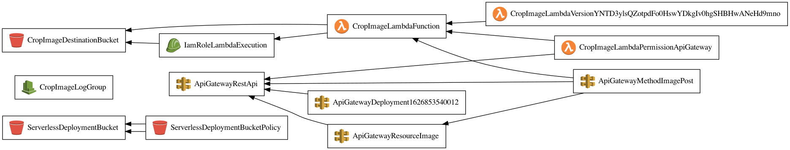

# Aircall.io - DevOps technical test

This test is a part of our hiring process at Aircall for [DevOps positions](https://aircall.io/jobs#SystemAdministrator). It should take you between 1 and 6 hours depending on your experience.

__Feel free to apply! Drop us a line with your Linkedin/Github/Twitter/AnySocialProfileWhereYouAreActive at jobs@aircall.io__

## Summary

An intern in our team has developped an application to resize images. It's working fine.

Unfortunatly, he left the company and we have no documentation or no insights at all about
what he did.

We just have the code.

With the following request to the application, the image is resized, stored and accessible from s3.

```
curl --location --request POST 'http://resize.aircall.com/image' \
--form 'file=@test/img.jpg' \
--form 's3Key=img.jpg'
```

The provided code is working.

It seems that our intern was using something called Lambda. Don't know what is it.

## What we want ?
Could you please take this code, and deploy it on AWS in a cool way?

Please, make Infra as Code because I heard that it's cool to do so.

You can also make some diagrams if needed.

Technically speaking, we need to get:

- Application URL
- URL of the resized images
- GitHub repo

## What I do

The provided code seem to import a `serverless` package.
So let's have a look on this package ;-)

### Infrastructure / Architecture

Infrastructure is based on simple serverless Architecture that use AWS services.
Serverless functions is containerized for compatibility purpose.

Besides, AWS boiler-plate around serverless (ECR, S3 bucket, API Gateway, Cloud Formation, IAM) which are mostly technical stuffs,
this project needs a dedicated S3 Bucket to store his cropping results.

The following diagrams show how `serverless` Framework deploy this function in AWS Services :


Can be (re)-generated with : `npm run infra:graph`

### Operations

Operations are described in [OPERATIONS.md](./OPERATIONS.md).

### Contributing

Please take a look at [CONTRIBUTING.md](./CONTRIBUTING.md) before starts working.

### TODOs

- Setup tests (TU/TI)

### Nice to have

- CI/CD
- auth

### Live

This project is deploy on my personal AWS Account.

The application URL is : `https://50ferugdt0.execute-api.eu-west-1.amazonaws.com/prod`

You can run the provided test command :
```
curl -X POST 'https://50ferugdt0.execute-api.eu-west-1.amazonaws.com/prod/image' \
--form 'file=@test/img.jpg' \
--form 's3Key=img.jpg'
```

Function output can be found in : `https://aircall-sre-hiring-test-cropimagedestinationbuck-9vhvns241x93.s3-eu-west-1.amazonaws.com/`

This information can be gathers with : `npm run infra:info -- -s prod`

#### Example

For `test/img.jpg`


The result is:

* 200 :


* 75 :


